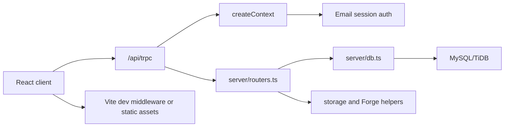

# Team Collab Hub Architecture

Last updated: 2026-07-13

## Project Overview

Team Collab Hub is a full-stack collaboration workspace for projects, issues, cycles, wiki documents, feedback, feature requests, architecture documents, attachments, and notification settings.

The app is served by an Express server. In development, Express mounts Vite middleware for the React client. The API surface is implemented with tRPC and backed by MySQL through Drizzle ORM.

## Tech Stack

| Layer | Technology |
| --- | --- |
| Client | React 19, Vite, TypeScript, Wouter, TanStack Query, tRPC client |
| UI | Tailwind CSS, Radix UI, lucide-react, shadcn-style components |
| Server | Node.js, Express, tRPC, TypeScript, tsx |
| Database | MySQL/TiDB via Drizzle ORM and mysql2 |
| Build | Vite for client, esbuild for server |
| Tests | Vitest |

## Directory Structure

```text
client/      React application, pages, components, hooks, styles
server/      Express entrypoint, tRPC routers, database access, integrations
shared/      Constants and shared error helpers
drizzle/     Database schema and migrations
patches/     pnpm patched dependencies
references/  Product and platform reference notes
.github/     GitHub Actions deployment and database import workflows
dist/        Production build output
```

## Core Modules And Data Flow



## Authentication

Authentication is currently local email login by default.

- `server/_core/sdk.ts` verifies the `app_session_id` cookie and loads the matching user from the local database.
- `auth.loginWithEmail` accepts an email address, matches an existing team member by email, or creates a normal member account when the email is new.
- Session cookies are signed JWTs. Local HTTP uses `SameSite=Lax`; HTTPS keeps `SameSite=None`.
- `server/_core/oauth.ts` keeps `/api/oauth/callback` only as a local-session compatibility route. It no longer exchanges authorization codes with Manus.
- The React client no longer redirects unauthorized errors to `manus.im` and no longer forwards `manus-cookie` from `sessionStorage`.
- The React client shows an email login form when `auth.me` returns no user.

## API Endpoints

| Endpoint | Purpose |
| --- | --- |
| `POST /api/trpc/*` | Main tRPC API for auth, projects, dashboard, wiki, issues, cycles, feedback, feature requests, Feishu settings, architecture docs, and attachments |
| `GET /api/oauth/callback` | Local session compatibility callback |
| `POST /api/scheduled/dailyDigest` | Scheduled daily digest handler |
| `POST /api/scheduled/dueReminder` | Scheduled due reminder handler |
| `GET /manus-storage/*` | Storage proxy for existing uploaded/static assets |

## Environment Variables

| Variable | Purpose |
| --- | --- |
| `DATABASE_URL` | MySQL/TiDB connection string |
| `PORT` | Preferred server port, defaults to `3000` |
| `NODE_ENV` | Enables Vite middleware when set to `development` |
| `JWT_SECRET` | Signs local session cookies |
| `BUILT_IN_FORGE_API_URL` | Forge API base URL for storage/AI/platform helpers |
| `BUILT_IN_FORGE_API_KEY` | Forge API key for server-side helpers |
| `VITE_FRONTEND_FORGE_API_URL` | Frontend Forge API base URL for map/helper components |
| `VITE_FRONTEND_FORGE_API_KEY` | Frontend Forge API key |
| `VITE_ANALYTICS_ENDPOINT` | Optional analytics endpoint referenced by `client/index.html` |
| `VITE_ANALYTICS_WEBSITE_ID` | Optional analytics website id |

## Deployment

- `.github/workflows/deploy.yml` builds the client and server bundle, uploads `dist/`, `package.json`, and `pnpm-lock.yaml` to `/opt/pm`, installs runtime dependencies, and restarts `pm2` process `pm-collab`.
- `.github/workflows/import-db.yml` uploads `team-collab-hub-database.sql` to `/opt/pm` and imports it into the database referenced by `/opt/pm/.env` `DATABASE_URL`. The dump contains `DROP TABLE` statements, so this workflow replaces matching production tables with the dump contents.
- The database import workflow runs when `team-collab-hub-database.sql` or the workflow changes on `main`, and it can also be started manually from GitHub Actions.

## Update Log

| Date | Type | Summary |
| --- | --- | --- |
| 2026-07-09 | Initial documentation | Created architecture documentation for the current full-stack app. |
| 2026-07-09 | Configuration change | Removed Manus OAuth as the default authentication path and enabled local admin authentication. |
| 2026-07-09 | Feature | Added passwordless local email login for team members and removed analytics placeholder script. |
| 2026-07-13 | Configuration change | Added a GitHub Actions database import workflow for the checked-in SQL dump. |

## Project Progress

| Date | Completed Work | Notes |
| --- | --- | --- |
| 2026-07-09 | Full-stack workspace app | React, Express, tRPC, Drizzle, and MySQL/TiDB are wired for project collaboration workflows. |
| 2026-07-09 | Local authentication mode | Browser requests automatically use a local admin user instead of redirecting to Manus OAuth. |
| 2026-07-09 | Email account login | Team members can log in directly with an email address stored in the users table. |
| 2026-07-13 | Production database import workflow | GitHub Actions can upload and import `team-collab-hub-database.sql` into the server database. |
