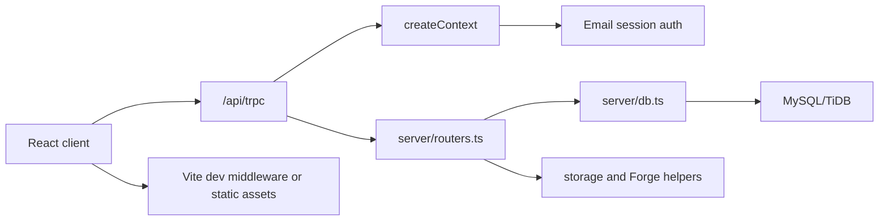

# Team Collab Hub Architecture

Last updated: 2026-07-21

## Project Overview

Team Collab Hub is a full-stack collaboration workspace for projects, issues, cycles, wiki documents, feedback, feature requests, architecture documents, attachments, and notification settings.

The app is served by an Express server. In development, Express mounts Vite middleware for the React client. The API surface is implemented with tRPC and backed by MySQL through Drizzle ORM.

## Tech Stack

| Layer | Technology |
| --- | --- |
| Client | React 19, Vite, TypeScript, Wouter, TanStack Query, tRPC client |
| UI | Tailwind CSS, Radix UI, lucide-react, shadcn-style components |
| Server | Node.js, Express, tRPC, TypeScript, tsx |
| Database | MySQL/TiDB via Drizzle ORM and mysql2 |
| Build | Vite for client, esbuild for server |
| Tests | Vitest |

## Directory Structure

```text
client/      React application, pages, components, hooks, styles
server/      Express entrypoint, tRPC routers, database access, integrations
shared/      Constants and shared error helpers
drizzle/     Database schema and migrations
patches/     pnpm patched dependencies
references/  Product and platform reference notes
scripts/     Idempotent production schema checks
.github/     GitHub Actions deployment and database import workflows
dist/        Production build output
```

## Core Modules And Data Flow



## Issue Review Flow

- Project membership roles are `owner`, `member`, and `tester`; testers are configured per project from the project members dialog.
- When an issue moves to `In Review`, the server stores the current assignee in `issues.originalAssigneeId`, assigns the issue to the project's primary tester, and sends review notifications to project testers.
- When an issue moves back to `In Progress` or `Todo`, the server restores `assigneeId` from `originalAssigneeId`, clears the temporary review handoff, and notifies the original assignee to continue work.
- `issues.myTodos` includes tasks assigned to the user, tasks authored by the user, and in-review tasks where the user is the original assignee, so review handoff remains visible to both testers and original owners.

## Task Board

- `client/src/pages/IssueBoard.tsx` renders status columns with dnd-kit and updates issue status through `issues.update`.
- The board's "我的任务" filter matches the dashboard todo scope: assigned, authored, or originally assigned during review.
- Drag-and-drop status changes use pointer-based column detection and explicit droppable metadata so the target status follows the column under the cursor instead of the nearest column corner.
- Failed drag status updates roll back the optimistic board state and display the server error message.

## Architecture Views and Task Creation

- Architecture documents default to a hybrid business architecture view: the document root and second-level headings form an ordered horizontal workflow, while the selected stage's subtree is rendered as a compact read-only mind map.
- `client/src/pages/architectureTree.ts` parses Markdown headings and nested lists into a shared tree model while ignoring fenced code blocks; the same tree supplies workflow stages and stage-specific mind-map Markdown.
- `client/src/pages/ArchitectureHybridView.tsx` aggregates linked issue counts and completion progress per workflow stage, preserves linked-task selection, and uses `ArchitectureMarkmap.tsx` for the detailed mind map.
- The existing editable mind-map and Markdown modes remain available from the view switcher; narrow screens keep controls and workflow stages in their own horizontal scroll areas.
- Architecture nodes can create linked issues from `client/src/pages/Architecture.tsx`.
- Project cards in `client/src/pages/ProjectSettings.tsx` can open the project's architecture diagram directly; parent projects with children open the merged architecture view.
- Top-level project cards can open the create-project dialog with the selected project prefilled as the parent, allowing direct child-project creation.
- Project management groups child projects by parent inside each status column; collapse state is scoped to the parent and column so folding one status column does not hide the same parent's children elsewhere.
- When a selected node has child nodes, the create dialog offers parent-only creation or child-node creation.
- Parent-only creation links one issue to the selected node and appends the child nodes as a Markdown checklist in the issue description.
- Child-node creation creates one issue per child node, applies the shared task fields to each issue, and links each new issue to its matching child node.
- The architecture task creation dialog constrains width and height, wraps long child-node labels, and scrolls internally to avoid overflowing the viewport.

## Authentication

Authentication is currently local email login by default.

- `server/_core/sdk.ts` verifies the `app_session_id` cookie and loads the matching user from the local database.
- `auth.loginWithEmail` accepts an email address, matches an existing team member by email, or creates a normal member account when the email is new.
- Email login normalizes copied input by trimming surrounding whitespace and lowercasing before validation and account lookup.
- Session cookies are signed JWTs. Local HTTP uses `SameSite=Lax`; HTTPS keeps `SameSite=None`.
- Development uses a fixed local-only session secret when `JWT_SECRET` is missing; production requires `JWT_SECRET` to be configured.
- Development uses a local app id when `VITE_APP_ID` is missing and can restore a temporary session user when no database row exists.
- `server/_core/oauth.ts` keeps `/api/oauth/callback` only as a local-session compatibility route. It no longer exchanges authorization codes with Manus.
- The React client no longer redirects unauthorized errors to `manus.im` and no longer forwards `manus-cookie` from `sessionStorage`.
- The React client shows an email login form when `auth.me` returns no user.
- The login screen uses a CSS-only loading spinner to avoid auth-screen crashes from external DOM mutations around SVG icon insertion.

## API Endpoints

| Endpoint | Purpose |
| --- | --- |
| `POST /api/trpc/*` | Main tRPC API for auth, projects, dashboard, wiki, issues, cycles, feedback, feature requests, Feishu settings, architecture docs, and attachments |
| `GET /api/oauth/callback` | Local session compatibility callback |
| `POST /api/scheduled/dailyDigest` | Scheduled daily digest handler |
| `POST /api/scheduled/dueReminder` | Scheduled due reminder handler |
| `GET /manus-storage/*` | Storage proxy for existing uploaded/static assets |

## Environment Variables

| Variable | Purpose |
| --- | --- |
| `DATABASE_URL` | MySQL/TiDB connection string |
| `PORT` | Preferred server port, defaults to `3000` |
| `NODE_ENV` | Enables Vite middleware when set to `development` |
| `JWT_SECRET` | Signs local session cookies; required in production |
| `BUILT_IN_FORGE_API_URL` | Forge API base URL for storage/AI/platform helpers |
| `BUILT_IN_FORGE_API_KEY` | Forge API key for server-side helpers |
| `VITE_APP_ID` | App id embedded in local session tokens; development falls back to a local app id |
| `VITE_FRONTEND_FORGE_API_URL` | Frontend Forge API base URL for map/helper components |
| `VITE_FRONTEND_FORGE_API_KEY` | Frontend Forge API key |
| `VITE_ANALYTICS_ENDPOINT` | Optional analytics endpoint referenced by `client/index.html` |
| `VITE_ANALYTICS_WEBSITE_ID` | Optional analytics website id |

## Deployment

- `.github/workflows/deploy.yml` builds the client and server bundle, uploads `dist/`, package metadata, and production schema checks to `/opt/pm`, installs runtime dependencies, verifies required schema additions, and restarts `pm2` process `pm-collab`.
- `scripts/ensure-production-schema.mjs` uses the active `pm-collab` PM2 `DATABASE_URL` first and falls back to `/opt/pm/.env` before the PM2 process exists. It warns when the two targets differ and idempotently adds the tester role and `issues.originalAssigneeId` to the database the running app actually uses. It changes schema only and never imports or replaces business data.
- `.github/workflows/import-db.yml` is manual-only and uploads `team-collab-hub-database.sql` to `/opt/pm` before importing it into the database referenced by `/opt/pm/.env` `DATABASE_URL`, falling back to the `pm-collab` PM2 environment. It strips the dump BOM, line comments, MariaDB/MySQL/TiDB executable comments, and dump-level `CREATE DATABASE`/`USE` statements so the server environment controls the target database. The dump contains `DROP TABLE` statements, so this workflow replaces matching production tables with the dump contents.
- Database dumps are not imported automatically on `main`; production database imports require manually starting the GitHub Actions workflow.

## Update Log

| Date | Type | Summary |
| --- | --- | --- |
| 2026-07-09 | Initial documentation | Created architecture documentation for the current full-stack app. |
| 2026-07-09 | Configuration change | Removed Manus OAuth as the default authentication path and enabled local admin authentication. |
| 2026-07-09 | Feature | Added passwordless local email login for team members and removed analytics placeholder script. |
| 2026-07-13 | Configuration change | Added a GitHub Actions database import workflow for the checked-in SQL dump. |
| 2026-07-13 | Configuration change | Serialized database import with deployment and import into the configured server database. |
| 2026-07-13 | Configuration change | Hardened database import by stripping dump helper statements and reading PM2 environment fallback. |
| 2026-07-13 | Configuration change | Set MySQL multi-statement import explicitly instead of appending it to the database URL. |
| 2026-07-13 | Configuration change | Stripped dump BOM and comment lines before production database import. |
| 2026-07-14 | Feature | Added project tester role and issue review handoff between assignees and testers. |
| 2026-07-14 | Feature | Added parent-task checklist generation and child-node batch task creation from architecture nodes. |
| 2026-07-14 | Bug fix | Normalized email login input and separated invalid-email errors from service login failures. |
| 2026-07-14 | Bug fix | Added a local development session-secret fallback and explicit production JWT secret validation. |
| 2026-07-14 | Bug fix | Replaced the auth-screen SVG loader with a CSS spinner to avoid DOM insertion errors during login loading transitions. |
| 2026-07-14 | Bug fix | Allowed development sessions to survive missing local app id or missing database user rows after email login. |
| 2026-07-14 | Bug fix | Constrained the architecture task creation dialog so long child-node labels and select controls stay inside the modal. |
| 2026-07-14 | Configuration change | Disabled automatic database dump imports on `main`; database imports now require manual workflow dispatch. |
| 2026-07-14 | Feature | Added project-card shortcuts for opening architecture diagrams and creating child projects from parent projects. |
| 2026-07-14 | Bug fix | Grouped cross-status child projects under parent headings and scoped project-card collapse by status column. |
| 2026-07-14 | Bug fix | Fixed task-board drag target detection so tasks move to the column under the cursor and show errors on failed status changes. |
| 2026-07-21 | Bug fix | Expanded "my tasks" visibility to include assigned, authored, and original-review-owner tasks. |
| 2026-07-21 | Configuration change | Added an idempotent production schema check before PM2 restarts without importing database dumps. |
| 2026-07-21 | Feature | Added a hybrid business architecture view with ordered top-level workflow stages and stage-specific mind-map details. |
| 2026-07-21 | Bug fix | Synchronized required issue columns against the active PM2 database and contained rejected architecture-task mutations in the client. |

## Project Progress

| Date | Completed Work | Notes |
| --- | --- | --- |
| 2026-07-09 | Full-stack workspace app | React, Express, tRPC, Drizzle, and MySQL/TiDB are wired for project collaboration workflows. |
| 2026-07-09 | Local authentication mode | Browser requests automatically use a local admin user instead of redirecting to Manus OAuth. |
| 2026-07-09 | Email account login | Team members can log in directly with an email address stored in the users table. |
| 2026-07-13 | Production database import workflow | GitHub Actions can upload and import `team-collab-hub-database.sql` into the server database. |
| 2026-07-14 | Tester review workflow | Issues entering review are assigned to project testers and returned to original assignees when moved back to active statuses. |
| 2026-07-14 | Architecture task creation | Parent architecture nodes can create one checklist-style parent issue or separate linked issues for every child node. |
| 2026-07-14 | Email login hardening | Copied or mixed-case email addresses are cleaned before login, and non-validation failures no longer appear as invalid email errors. |
| 2026-07-14 | Local session startup | Development login works without a local `.env` `JWT_SECRET`, while production still requires a configured signing secret. |
| 2026-07-14 | Auth loading stability | The login page no longer depends on lucide's `LoaderCircle` SVG while transitioning between unauthenticated and authenticated states. |
| 2026-07-14 | Development auth continuity | Local email login can restore `auth.me` from a valid session cookie even when the local database is not configured. |
| 2026-07-14 | Architecture modal layout | New-task dialogs from architecture nodes now use internal scrolling and responsive fields so long task lists do not overflow. |
| 2026-07-14 | Manual database imports | Merging to `main` no longer imports `team-collab-hub-database.sql`; operators must start the import workflow manually when needed. |
| 2026-07-14 | Project management shortcuts | Project management cards now link directly to architecture diagrams and parent projects can start child-project creation in place. |
| 2026-07-14 | Project hierarchy display | Child projects in a different status column now show their parent title and can be folded independently per column. |
| 2026-07-14 | Task-board drag stability | Dragging tasks now resolves the destination from pointer-hit columns and reports backend status-change errors to the user. |
| 2026-07-21 | My tasks visibility | Dashboard and task-board personal filters now show assigned tasks, authored tasks, and in-review tasks that originated from the user. |
| 2026-07-21 | Production schema synchronization | Deployments now add required tester-review schema fields when missing while preserving all production records. |
| 2026-07-21 | Hybrid business architecture | Architecture documents now combine an ordered overall workflow with compact mind-map details for the selected stage, including per-stage linked-task progress. |
| 2026-07-21 | Active production database alignment | Schema checks now follow the database used by the running PM2 process, preventing issue creation failures when PM2 and `.env` database targets differ. |
